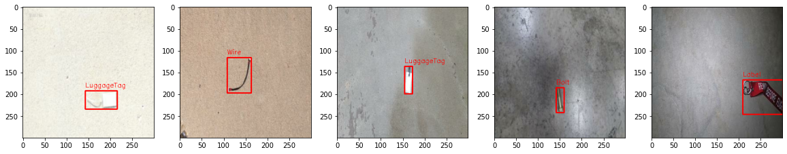

# Artificial Intelligence - Abgabe 2
Dieses Repository enthält den Code und die Ressourcen für die zweite Abgabe, die im 6. Semester im Rahmen des Kurses über Künstliche Intelligenz erstellt wurde. 
Der Schwerpunkt des Projekts liegt auf der Entwicklung und Implementierung eines Vision Systems zur Objekterkennung von Foreign Object Debribs (FOD), worunter jegliche Fremdkörper auf Flugbetriebsflächen fallen. Betrachtet werden die Klassen "Wire", "LuggageTag", "Label" und "Bolt".



## Projektstruktur
Das Projekt ist in mehrere Ordner und Dateien gegliedert, die jeweils einem bestimmten Zweck dienen:

1. **data/:** Dieser Ordner enthält die Trainingsdaten. Einerseits wird der originale Datensatz von Munyer et al. 2022 https://arxiv.org/pdf/2110.03072.pdf im Pascal-VOC Format heruntergeladen. Anderseits wird auch der im YOLO-Format aufbereitete Datensatz in diesem Ordner gespeichert.
2. **models/:** In diesem Ordner werden die Gewichte der trainierten Modelle gespeichert. Die Gewichte des Transfer Learning von dem YOLO-Modell werden gesondert in dem runs-Ordner gespeichert.
3. **vision.ipynb:** Dieses Jupyter-Notebook wird verwendet, um die zuvor trainierten Modelle zu laden und über eine Webcam die FOD-Erkennung auszuführen. 
4. **training.ipynb:** Schließlich wird dieses Jupyter-Notebook zum Training und zur Evaluation der Modelle verwendet. 

## Erste Schritte

Zur Ausführung können die folgenden Schritte durchgeführt werden:

1. Klonen des Repository auf den lokalen Rechner:
````
git clone https://github.com/dschmtz/Abgabe-2-Object-Detection.git
cd Abgabe-2-Object-Detection
````

2. Installieren von erforderlichen Abhängigkeiten. Es wird empfohlen, eine virtuelle Umgebung einzurichten, um Konflikte zu vermeiden:
````
python -m venv venv
source venv/bin/activate   # On Windows, use: venv\Scripts\activate
pip install -r requirements.txt
````

3. Training der Modelle über das training.ipynb Jupyter-Notebook. Gleichzeitig findet auch die Evaluation in diesem Notebook statt.

4. Vision System ausführen in dem vision.ipynb Notebook. Das Vision System verwendet die Kamera und kann zur Erkennung von FODs genutzt werden.

## Ergebnisse

| Modell | Anzahl der Parameter | Trainingsdauer | Genauigkeit Lokalisierung | Genauigkeit Klassifikation |
|---|---|---|---|---|
| CNN (ohne Transfer) | 9,98 mio | 116 min | 0,9434 | 1,0 |
| Transfer (MobileNetV2) | 3,42 | 42 min | 0,9365  | 0,9983 |
| Transfer (YOLOv8s) | 11,2 mio | 91 min | 0,998 | 1,0 |

Aus der Tabelle geht hervor, dass das Training eines CNN-Modells ohne Transfer Learning die längste Trainingsdauer besitzt. Dafür erreicht es eine Genauigkeit bei der Klassifikation von 1,0. Beide Transfer Learning Modelle weisen eine geringere Trainingsdauer auf, obwohl das YOLOv8s-Modell mit 11,2 Millionen Parameter circa 1,3 Millionen Parameter mehr besitzt.

Mit deutlichem Abstand besitzt das MobileNetV2-Transfer Learning Modell am wenigsten Parameter und benötigte mit 42 Minuten die geringste Zeit zum Training. Gleichzeitig fällt auch die Performance am schlechtesten aus.

Die besten Ergebnisse erzielt das YOLOv8s-Modell mit einer Genauigkeit bei der Lokalisierung von 0,998 und einer mittellangen Trainingsdauer von 91 Minuten.

## Konklusion
Während die Klassifikation mit über >99% Genauigkeit bei allen Modellen eine gute Performance erreicht, erreicht die Lokalisierung eine Genauigkeit von circa 93%. Es scheint, dass die Transfer-Learning-Modelle (MobileNetV2 und YOLOv8s) in diesem Szenario eine gute Balance zwischen Genauigkeit und Ressourcennutzung bieten. Wenn ein schnelles Training oder ein leichtgewichtiges Modell das Ziel ist, dann übersteigt das MobileNetV2 die anderen Modelle. Wenn die Genauigkeit im Fokus steht, kann das YOLOv8s-Modell die anderen Modelle schlagen.

Abschließend kann eine weitere Forschung die anderen Klassen oder die Erkennung mehrerer Objekte in einem Bild untersuchen. Zudem ist während eines praktischen Tests mit dem Vision System in dem vision.ipynb-Notebook aufgefallen, dass die Klassifikation auch in der Realität zuverlässig ist, jedoch die Lokalisierung sehr ungenau ist. Weiterführende Untersuchungen sollten daher zusätzliche Datensätze berücksichtgen, um mehr Varietät in den Datensatz zu bringen. 
